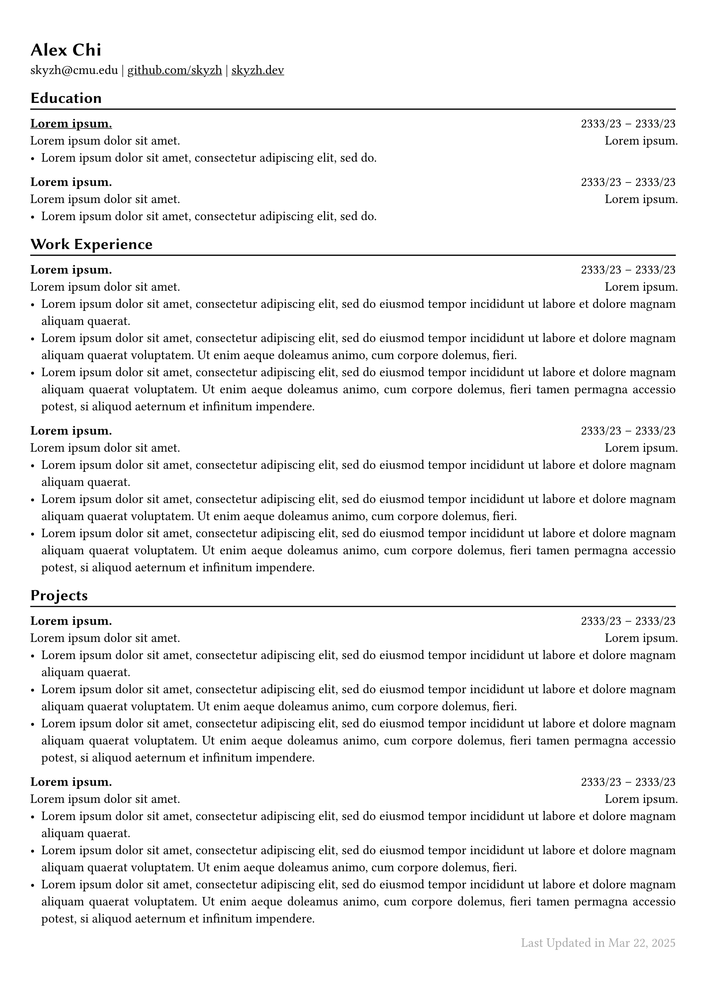

# Typst CV Template

A simple CV template for [typst.app](https://typst.app).

## How To Use

### Quick Start

Create a project on [typst.app](https://typst.app), copy paste everything in https://github.com/skyzh/chicv/blob/master/template/cv.typ. All done!

### Customize your CV

To change the text size, you can uncomment the lines in `cv.typ` and set to your choice. (Recommended text size for CV is from 10pt to 12pt)

You can also change the page margin in `cv.typ` to fit in more contents in a single page. The margin default is set to `(x: 0.9cm, y: 1.3cm)`.

Don't forget to include `#chiline()` every time you open a new section, this line acts as a perfect split.

For basic typst syntax, check this template as a reference, it's super easy to understand and use!

For advanced topics, please refer to [official reference](https://typst.app/docs/reference/) by typst.

## GitHub Actions Deployment

This repository includes a GitHub Actions workflow that automatically:
1. Compiles the CV template to a PDF using Typst
2. Uploads the generated PDF to an AWS S3 bucket

### Setting Up GitHub Secrets

To use the automatic S3 deployment, you need to add the following secrets to your GitHub repository:

| Secret Name | Description |
|-------------|-------------|
| `AWS_ACCESS_KEY_ID` | Your AWS access key with S3 permissions |
| `AWS_SECRET_ACCESS_KEY` | Your AWS secret access key |
| `AWS_REGION` | The AWS region where your bucket is located (e.g., `us-east-1`) |
| `S3_BUCKET` | The name of your S3 bucket (e.g., `my-resume-bucket`) |

You can add these secrets in your GitHub repository under Settings → Secrets and variables → Actions → New repository secret.

## Showcases

### Sample CV

### Chi's CV

[cv.pdf](https://skyzh.github.io/files/cv.pdf)
